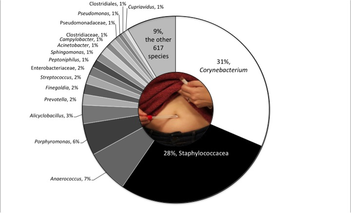

# Plotly-Homework---Belly-Button-Biodiversity

In this assignment, you will build an interactive dashboard to explore the Belly Button Biodiversity dataset, which catalogs the microbes that colonize human navels.
The dataset reveals that a small handful of microbial species (also called operational taxonomic units, or OTUs, in the study) were present in more than 70% of people, while the rest were relatively rare.

This homework make me work with Plotly, D3.json(), as well as how to parse data in JSON format, using JavaScript to create and deploy interactive charts.

main take aways.

How you would fetch data from the API (d3.json() to send an HTTP request and load .json file)
Use JavaScript methods and Math object to massage the data into the appropriate JSON format
Use Plotly.js newPlot method to create the bar chart, passing in the JSON for the data

Please check this link for interactive dashboard: https://d4n13l-50l.github.io/Belly-Button-Biodiversity.io/index.html